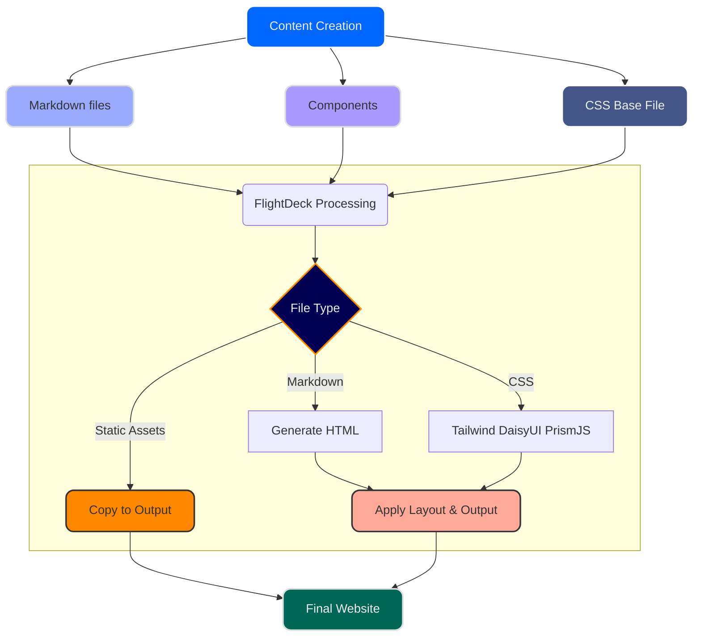

# About SpeakEZ Technologies

SpeakEZ Technologies was founded with a mission to create intelligent systems that respect privacy, deliver reliability, and provide exceptional performance.

## Our Team

Our team consists of experts in:

- Designs that Scale with Intelligence & Decision Support
- Machine Learning & Model Training
- Data Analysis with Advanced Analytics
- High Performance Software Development
- Commercial & Industrial Applications

## Our Mission

We believe that technology should serve people, not the other way around. Our systems are designed with human needs in mind, focusing on user experience while maintaining strict privacy standards.

## Our Approach

At SpeakEZ, we take a holistic approach to system design:

1. **Privacy First**: We design with privacy as a foundational principle, not an afterthought
2. **Performance Matters**: Our systems are optimized for speed and efficiency
3. **User-Centered Design**: Everything we build focuses on the people who use it
4. **Continuous Improvement**: We're always learning and evolving

## Code excerpt

```fsharp
open CoordinateSharp

let find_Closest_TimeUnit =
    let el = EagerLoad(EagerLoadType.Celestial)
    el.Extensions <- EagerLoad_Extensions(EagerLoad_ExtensionsType.Solar_Cycle)
    fun addTimeFn rangeStart rangeEnd (c : Coordinate) azimuth adjustNegatively ->
        let start = if adjustNegatively then -rangeEnd else rangeStart
        [start..rangeEnd]
        |> List.map (fun x -> 
            let newTime = addTimeFn (float x)
            let nc = Coordinate(c.Latitude.ToDouble(), c.Longitude.ToDouble(), newTime, el)
            nc.Offset <- c.Offset
            (Math.Abs(nc.CelestialInfo.SunAzimuth - azimuth), x)
        )
        |> List.minBy (fun (diff, _) -> diff)
        |> fun (_, closestTime) -> addTimeFn (float closestTime)

```

## Website Build Process

The following diagram illustrates how content flows through our static site generation process:



This automated process ensures consistency and allows for easy customization through the configuration files.