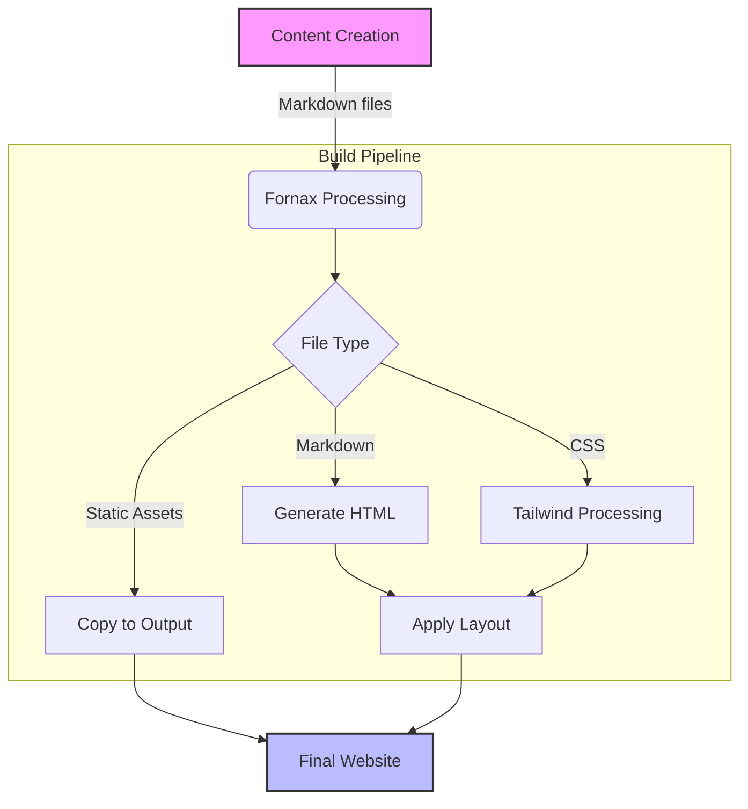

# Workflow Post

Lorem ipsum dolor sit amet, consectetur adipiscing elit. Morbi nisi diam, vehicula quis blandit id, suscipit sed libero. Proin at diam dolor. In hac habitasse platea dictumst. Donec quis dui vitae quam eleifend dignissim non sed libero. In hac habitasse platea dictumst. In ullamcorper mollis risus, a vulputate quam accumsan at. Donec sed felis sodales, blandit orci id, vulputate orci.

<!--more-->

## Website Build Process

The following diagram illustrates how content flows through our static site generation process:

This automated process ensures consistency and allows for easy customization through the configuration files.

In est nulla, ornare vitae elit sed, consequat sollicitudin dui. Duis posuere nulla malesuada elit volutpat ultricies. Mauris et tellus tortor. In ligula elit, pellentesque eget est et, mattis rhoncus nisl. Sed orci ex, mollis quis justo eu, dapibus tincidunt turpis. Sed rhoncus odio non lacus ullamcorper volutpat. Suspendisse blandit ullamcorper condimentum. Quisque et viverra nisi. Vivamus in mollis nulla. Nulla faucibus sed ligula et blandit.

Vivamus nec libero faucibus, cursus ex et, consequat mauris. Pellentesque commodo ullamcorper vestibulum. Donec efficitur, ipsum et dapibus varius, purus mauris gravida augue, eu mattis lorem turpis eget dui. Curabitur nibh erat, posuere sed eros a, blandit venenatis risus. Vestibulum cursus imperdiet ultrices. In eu efficitur dui, eget tempus enim. Nunc imperdiet, enim et sagittis lacinia, lacus metus eleifend purus, blandit pellentesque leo ante ac velit. Nam ac sagittis est. Cras accumsan, odio vel lacinia mollis, metus tortor malesuada nisi, et consectetur neque quam in erat. Sed ultricies aliquam hendrerit. Etiam non aliquam ipsum, id rutrum magna. Morbi id tincidunt mauris. Vestibulum nec iaculis massa. Etiam fringilla, orci quis faucibus vulputate, risus nibh finibus nisl, et vehicula ipsum leo a tortor. Curabitur mauris elit, bibendum vitae velit at, dignissim ornare arcu.
